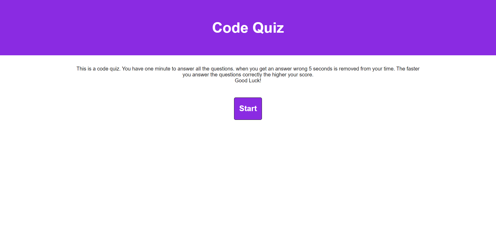
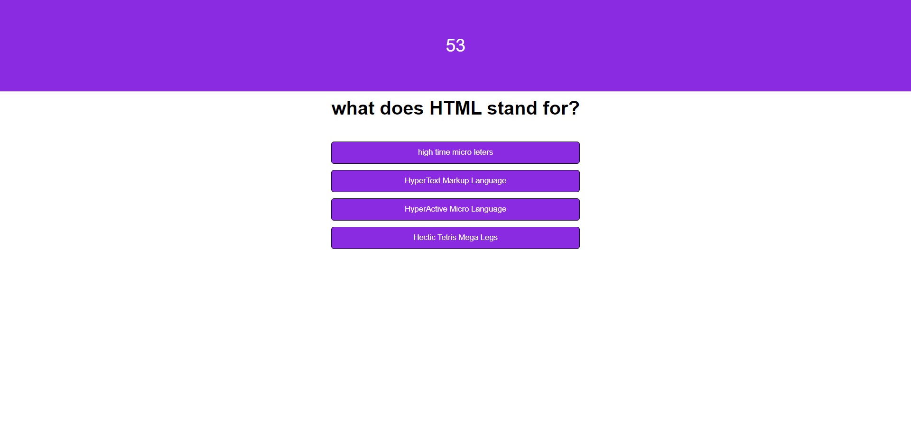

# wk4-codequiz
## Project
This is a code quiz. You have one minute to answer all the questions. when you get an answer wrong 5 seconds is removed from your time. The faster you answer the questions correctly the higher your score.

## Github link
The repository link to the project

https://maks-pixel.github.io/wk4-codequiz/

## File links
to open [index.html](index.html) file to view the code

to open the screenshot here is the link [screenshotOne.png](assets/images/screenshotOne.png) [screenshotTwo.png](assets/images/screenshotTwo.png)

